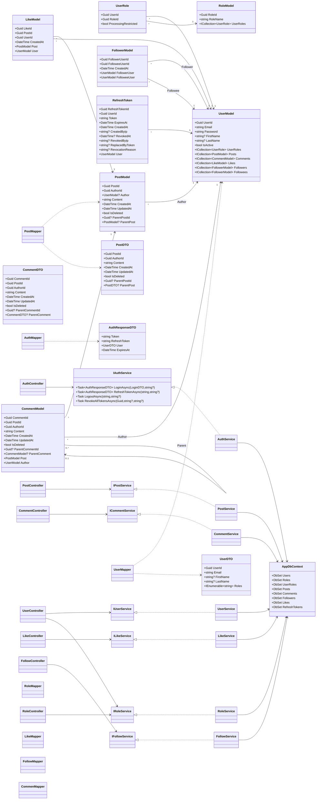

```mermaid
classDiagram
direction LR

%% Data
class AppDbContext {
  +DbSet<UserModel> Users
  +DbSet<RoleModel> Roles
  +DbSet<UserRole> UserRoles
  +DbSet<PostModel> Posts
  +DbSet<CommentModel> Comments
  +DbSet<FollowerModel> Followers
  +DbSet<LikeModel> Likes
  +DbSet<RefreshToken> RefreshTokens
}

%% Models
class UserModel {
  +Guid UserId
  +string Email
  +string Password
  +string? FirstName
  +string? LastName
  +bool IsActive
  +ICollection~UserRole~ UserRoles
  +ICollection~PostModel~ Posts
  +ICollection~CommentModel~ Comments
  +ICollection~LikeModel~ Likes
  +ICollection~FollowerModel~ Followers
  +ICollection~FollowerModel~ Followees
}

class RoleModel {
  +Guid RoleId
  +string RoleName
  +ICollection~UserRole~ UserRoles
}

class UserRole {
  +Guid UserId
  +Guid RoleId
  +bool ProcessingRestricted
}

class PostModel {
  +Guid PostId
  +Guid AuthorId
  +UserModel? Author
  +string Content
  +DateTime CreatedAt
  +DateTime UpdatedAt
  +bool IsDeleted
  +Guid? ParentPostId
  +PostModel? ParentPost
}

class CommentModel {
  +Guid CommentId
  +Guid PostId
  +Guid AuthorId
  +string Content
  +DateTime CreatedAt
  +DateTime UpdatedAt
  +bool IsDeleted
  +Guid? ParentCommentId
  +CommentModel? ParentComment
  +PostModel Post
  +UserModel Author
}

class FollowerModel {
  +Guid FollowerUserId
  +Guid FolloweeUserId
  +DateTime CreatedAt
  +UserModel FollowerUser
  +UserModel FolloweeUser
}

class LikeModel {
  +Guid LikeId
  +Guid PostId
  +Guid UserId
  +DateTime CreatedAt
  +PostModel Post
  +UserModel User
}

class RefreshToken {
  +Guid RefreshTokenId
  +Guid UserId
  +string Token
  +DateTime ExpiresAt
  +DateTime CreatedAt
  +string? CreatedByIp
  +DateTime? RevokedAt
  +string? RevokedByIp
  +string? ReplacedByToken
  +string? RevocationReason
  +UserModel User
}

UserRole "*" --> "1" UserModel
UserRole "*" --> "1" RoleModel
PostModel "*" --> "1" UserModel : Author
CommentModel "*" --> "1" PostModel
CommentModel "*" --> "1" UserModel : Author
CommentModel "0..*" --> "0..1" CommentModel : Parent
LikeModel "*" --> "1" PostModel
LikeModel "*" --> "1" UserModel
FollowerModel "*" --> "1" UserModel : Follower
FollowerModel "*" --> "1" UserModel : Followee
RefreshToken "*" --> "1" UserModel

%% DTOs (key ones)
class UserDTO {
  +Guid UserId
  +string Email
  +string? FirstName
  +string? LastName
  +IEnumerable~string~ Roles
}
class PostDTO {
  +Guid PostId
  +Guid AuthorId
  +string Content
  +DateTime CreatedAt
  +DateTime UpdatedAt
  +bool IsDeleted
  +Guid? ParentPostId
  +PostDTO? ParentPost
}
class CommentDTO {
  +Guid CommentId
  +Guid PostId
  +Guid AuthorId
  +string Content
  +DateTime CreatedAt
  +DateTime UpdatedAt
  +bool IsDeleted
  +Guid? ParentCommentId
  +CommentDTO? ParentComment
}
class AuthResponseDTO {
  +string Token
  +string RefreshToken
  +UserDTO User
  +DateTime ExpiresAt
}

%% Interfaces / Services
class IAuthService {
  +Task~AuthResponseDTO~ LoginAsync(LoginDTO,string?)
  +Task~AuthResponseDTO~ RefreshTokenAsync(string,string?)
  +Task LogoutAsync(string,string?)
  +Task RevokeAllTokensAsync(Guid,string?,string?)
}
class AuthService
class IUserService
class UserService
class IPostService
class PostService
class ICommentService
class CommentService
class ILikeService
class LikeService
class IFollowService
class FollowService
class IRoleService
class RoleService

IAuthService <|.. AuthService
IUserService <|.. UserService
IPostService <|.. PostService
ICommentService <|.. CommentService
ILikeService <|.. LikeService
IFollowService <|.. FollowService
IRoleService <|.. RoleService

AuthService --> AppDbContext
UserService --> AppDbContext
PostService --> AppDbContext
CommentService --> AppDbContext
LikeService --> AppDbContext
FollowService --> AppDbContext
RoleService --> AppDbContext

%% Controllers
class AuthController
class UserController
class PostController
class CommentController
class LikeController
class FollowController
class RoleController

AuthController --> IAuthService
UserController --> IUserService
UserController --> IRoleService
PostController --> IPostService
CommentController --> ICommentService
LikeController --> ILikeService
FollowController --> IFollowService
RoleController --> IRoleService

%% Mapping
class PostMapper
class UserMapper
class RoleMapper
class AuthMapper
class LikeMapper
class FollowMapper
class CommenMapper

PostMapper ..> PostModel
PostMapper ..> PostDTO
UserMapper ..> UserModel
UserMapper ..> UserDTO
AuthMapper ..> AuthResponseDTO
```